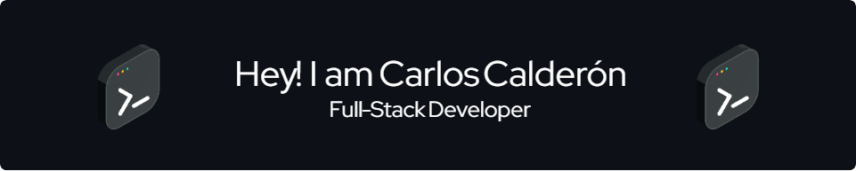

# Sobre mí 👋

¡Hola! Soy un desarrollador web con sólidas bases en programación y buenas prácticas de desarrollo. Me especializo en el **Front-End**, donde combino diseño funcional, rendimiento y experiencia de usuario para construir aplicaciones modernas, accesibles y escalables.

Mi stack principal incluye herramientas como **React**, **Next.js**, **Tailwind CSS**, lo que me permite desarrollar interfaces rápidas, bien estructuradas y con una arquitectura clara.  aunque mi enfoque está en el lado del cliente, también cuento con la capacidad y la confianza para trabajar en el **Back-End**. Utilizo **NestJS**, **Prisma**, **JWT** y bases de datos como **PostgreSQL** para crear APIs robustas, seguras y eficientes.

## 🖥️ Frontend

- **React**: Librería para construir interfaces de usuario dinámicas, componibles y basadas en el manejo eficiente del estado.
- **Next.js**: Framework para construir aplicaciones web modernas con renderizado híbrido (SSR/SSG), ideal para mejorar el rendimiento y la optimización SEO.
- **Axios**: Cliente HTTP robusto y versátil para el consumo de APIs RESTful desde el frontend.
- **Rspack**: Empaquetador moderno de alto rendimiento que utilizo como alternativa a Webpack en proyectos donde se requiere una mayor velocidad de compilación y tiempos de desarrollo reducidos.
- **Tailwind CSS**: Mi herramienta principal para estilos, basada en clases utilitarias que permiten construir interfaces modernas, responsivas y altamente personalizables.
- **Emotion**: Alternativa basada en CSS-in-JS, útil para aplicar estilos dinámicos y encapsulados cuando el proyecto lo requiere.

## 🧠 Backend

- **NestJS**: Framework escalable basado en módulos, con soporte nativo para TypeScript. Se construye sobre **Node.js** y **Express.js**, lo que lo hace ideal para APIs bien estructuradas y mantenibles.
- **Prisma**: ORM moderno y eficiente con tipado estático, ideal para trabajar con bases de datos relacionales. Como alternativa, también utilizo **TypeORM** cuando el proyecto lo requiere.
- **JWT**: Implementación de autenticación y autorización mediante tokens, asegurando sesiones seguras y controladas.

## 🗃️ Bases de Datos

- **PostgreSQL**: Sistema de gestión relacional confiable, ideal para estructuras complejas de datos.

## 🛠️ DevOps y Calidad

- **Git**: Sistema de control de versiones distribuido, esencial para la gestión de código y colaboración en equipo. Utilizo flujos de trabajo estructurados como **Git Flow** para organizar eficientemente el ciclo de desarrollo.
- **Biome**: Herramienta principal que utilizo para análisis estático de código y formateo. Combina linting y formateo en un solo entorno optimizado, ideal para proyectos en **JavaScript** y **TypeScript**. Puedo usar como alternativa **ESLint / Prettier**

Estoy comprometido con la mejora continua, tanto en habilidades técnicas como en soft skills. Si estás interesado en colaborar en proyectos, compartir ideas o simplemente conectar, no dudes en contactarme.  
🚀 *¡Estoy siempre listo para el próximo reto!*

## My Skill Set  

<table><tr><td valign="top" width="33%">

### Frontend  

  
  
  
  
  
  
  
  

</td><td valign="top" width="33%">

### Backend  

  
  
  
  
  
  
  

</td><td valign="top" width="33%">

### DevOps  

  
  
  
  

</td></tr></table>

# GitHub Stats

  

    
  

   
  

      
  

   
  

      
  

   
  

      
  

   

# 🌐 Social Networks

  

    
    
    
    
    
    
    
    
    
    
    
  

 